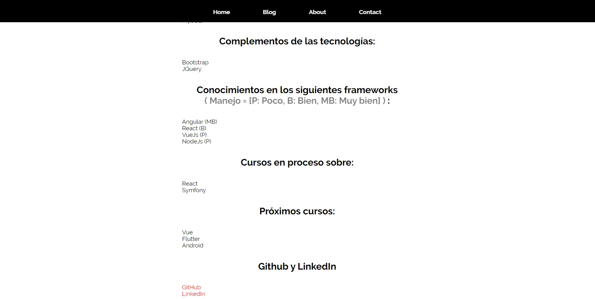

# Primeros Pasos en Laravel 5
Es la primera vez que toco Laravel, hice una página muy básica.
Haciendo el uso de las plantillas que provee Laravel, de extension .blade.php y utilizando el sistema de Rutas para los enlaces del menú.

## Vistas

### Home

### Blog

### About

### Contact

